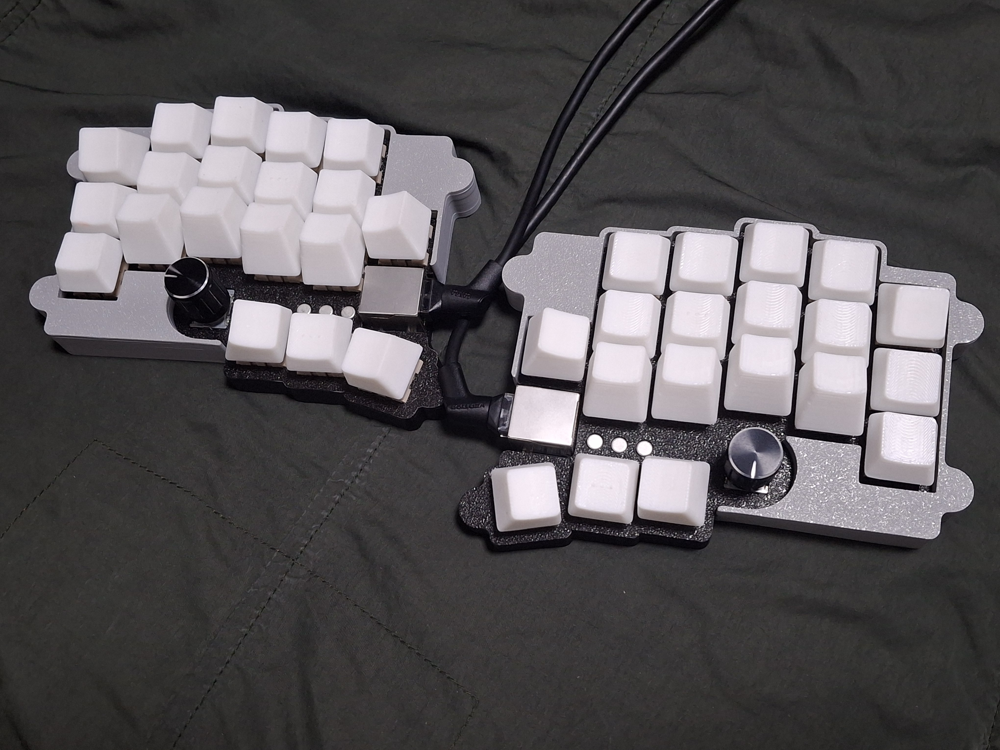

# KeeNoard

**KeeNoard**(name intended typo between B and N) is 38-key split keyboard with rotary encoder and multiple center key.

Inspired by the former great [-Cheapino-](https://github.com/tompi/cheapino) this uses only one board and [Japanese duplex matrix](https://kbd.news/The-Japanese-duplex-matrix-1391.html), controlled ghosting with three PNP transistor and active-high matrix.

## Preparation

- 1x rp2040 zero (boards formly created by waveshare)

- 2x KeeNoard PCB Boards

- 1x printed case sets, which you want to make it

- 6x TO-18 PNP transistors, or 6x SOT-23 PNP transistors.

- 50x diodes

- 2x EC11 encoders and cap

- 14x M2x6 screws, flathead

- 1x RJ45 cable

- 2x RJ45 connector, in 18mm

## Build Guides

work in progress. sorry!

You can see the images in the folder, which uploaded for build guides.

This uses [qmk](https://qmk.fm/) to build the firmware. Copy "keenoard" folder which is in "firmware" directory to qmk_firmware\keyboards folder, and build it via qmk msys. Also, I'm working for the vial version.

## Licenses

matrix.c and other qmk-related things follows GNU GPL license.

other codes follows MIT license.

all designs and the hardware board follows CC BY-SA 4.0 license.

If you want to make a commercial product, it would be appreciated [if you sponsor some bucks for me.](https://github.com/sponsors/yuburoll)
